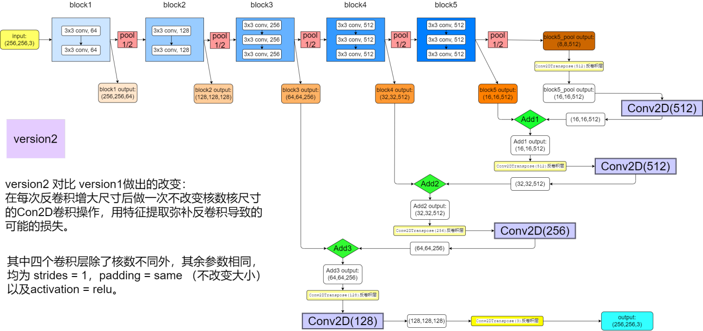

# 
 基于Mindspore AI框架的肾脏肿瘤分割

### 
 小组成员：陈远腾 赵昱杰 彭睿思 游昆霖 谷朝阳 

[TOC]

## 一、赛题介绍

### 1：赛题背景

全球每年肾癌新发病例超过400000例，且发病率正在逐年增加，处于局部状态的肾肿瘤可通过手术进行治疗。肾肿瘤在计算机断层扫描（CT）成像中可被显著观察到，这使得放射科医生和外科医生能够研究肿瘤大小、形状和外观及其治疗前景之间的关系并进行科学的手术规划。然而，肿瘤形态信息的人工分割是一项费力的工作，同时非常依赖医师的诊断经验，肾肿瘤和周围解剖结构的自动分割是消除这些局限性的有力工具。
传统的肿瘤分割方法，如阈值分割法、区域增长法和活动轮廓模型方法，主要基于边缘和灰度分布的差异。然而，由于不同个体其肿瘤CT图像在形态、纹理和灰度分布上存在较大差异，可能出现多个肿瘤及其模糊边界，这些传统方法难以实现高效准确的肿瘤分割。
近年来深度学习方法在图像分割领域引起了广泛关注，特别是UNet等网络在肿瘤分割中取得了显著的效果，但这些网络在结构设计、训练模式等方面仍存在进一步提升空间。本次比赛面向全国对深度学习和医学影像有兴趣的研究者，吸引大家设计基于高性能深度学习模型的肾肿瘤分割算法，实现肿瘤的快速精准分割。

### 2：赛题任务

这一挑战的目标是开发快速可靠的肾脏和肾脏肿瘤语义分割方法，形态上的异质性以及模糊的组织边界可能是需要解决的难题。比赛提供接受部分或根治性肾切除术的210例肾癌患者的动脉期腹部CT扫描数据，并标记了真实的语义分割结果。

具体来说，赛题提供的数据集中包含210个nii格式的图像及其标注信息：

其中每个nii格式的图像都包含了丰富的空间信息，因此可以处理切片为多个平面图像及其语义分割的标注作为训练集，其中每个平面图像的语义分割标注包含三种像素值，对应三分类：0代表背景，1代表肾脏，2代表肿瘤。

## 二、问题与挑战

### 1：问题定位

+ 本组选题为肾脏肿瘤分割，这一选题要求我们在小样本的基础上开发出快速可靠的肾脏和肾脏肿瘤的语义分割方法。这种基于小样本的医学图像语义分割主要面临着几大挑战：
  1. 多样化的医学图像模态（nii格式）
  2. 小规模的样本数（仅210例）
  3. 医学图像样本中形态的异质性和组织边界的模糊性

### 2：解决措施

1. 针对多样化的医学图像模态，我们进行了图像预处理，将不易直接读取的nii格式图像和标签转化为了更容易处理和训练的array格式数据。

2. 针对小规模的样本数，我们在训练中进行了一定的数据增强。使得少量数据的训练也能获得较好的分割结果

3. 针对医学图像样本中异质性和模糊性，我们调研分析了更加适合医学语义分割的FCN、LinkNet、U-Net等深度学习模型，并对这些模型进行了集成。相比传统针对自然图像所采用的CNN等深度学习模型，在IOU等指标上取得了更好的成绩。

## 三、数据格式与模型调研

### 1：医学图像预处理

+ 相关介绍：
  NII格式也称为NIFTI格式，主要包含三个部分：hdr、ext和img。相比普通的jpg等图像格式，nii这种专用于医学图像存储的格式蕴含着更多的信息，除了存储图像信息的矩阵外，还包含着和物理坐标相关的仿射矩阵以及Header头文件信息，能够更好的记录3D或4D的医学图像特征。然而这种格式的文件由于更加专业化，不易于直接查看和参与深度学习模型的训练，因此需要进行预处理。

+ 预处理方式：

  针对NII格式的图像，我们主要调用了python的Nibabel进行了预处理。通过Nibabel库中的load、get_data等函数，在保留图像重要信息的基础上将其转化为了更易于处理的array数组形式。
  同时，综合考虑到官方文档说明、内存显存条件和实验的精度需求，我们也进一步调整了训练数据的数据类型和精度。例如，图像数据我们仍以float32进行保存，而针对分类情况较少的标签值，使用uint8进行保存。

  经过格式和精度的分步预处理，最后的数据能够以尽可能小的内存占用保留尽量多的重要信息，从而支持我们更加方便、高效的开展后续实验，并加快训练速度。

### 2：传统模型局限性

传统的深度学习模型，如CNN等，由于在卷积之后接上的若干全连接层，将会把特征图映射成为特征向量，表示图像级别的分类概率。全连接层的存在也导致输入空间信息的丢失，使得这些模型不能在像素级别的语义分割取得良好的表现。
为在模型训练和推理过程中保留语义及空间信息，本组针对图像语义分割的开篇之作——FCN、当前处理该问题最热门的模型——U-Net、以及更加节约运算时间的Link-Net等模型展开了调研，并在实验中对这几种模型进行了实现和集成。

### 3：FCN（全卷积网络）

+ 模型特点

  区别于图像层面的分类，语义分割要求能够判断每个像素点的级别，从而实现更加精准的分割。FCN主要通过三个创新点对此进行了较好的实现：

1. 全卷积化（Fully Convolutional）

   通过将基础深度学习网络最后的全连接层换成卷积层，最终能够获得一个二维的特征图而非一维向量，通过这个热图可以初步实现像素级的语义分割。

2. 反卷积（deconvolution）
   端到端像素级的语义分割要求输出图像和输入图像应当是大小一致的，然而传统的卷积池化操作将会缩小图片尺寸。通过反卷积的方式进行上采样，能够将特征图恢复到原图尺寸，从而保留空间信息，对每个像素产生预测。

3. 跳跃结构（Skip Architecture）
   为了充分结合较低层次的位置信息和较深层次的语义信息，FCN提出了跳跃结构，通过跨层跳跃的方式，结合了网络浅层细粒度信息和深层信息实现了精准分割。

### 4：U-Net

+ U-Net模型特点介绍

  1. 编解码结构

     和FCN相似，U-Net也使用了编码和解码的结构思路。该模型左右对称，前半部分为编码，将进行特征提取，增加鲁棒性，获得高层抽象的语义信息；后半部分为解码，将会利用编码的抽象特征恢复原图尺寸得到最终分割结果。相比FCN，U-Net具有更加对称的用于捕捉上下文的收缩路径和允许精确定位的拓展路径，获得了更加精确的语义分割结果。

  2. 跳跃结构

     有别于FCN采用的逐点相加操作，U-Net使用concat操作，即维度拼接融合来实现跳跃结构，模型能够依赖更多的信息，改善上采样信息不足的问题，提高了分割精度。

  3. overlap-tile策略

     由于U-Net网络不会直接输入图像，而是将图像分块（patch）之后再输入，为了实现对图像的无缝分割，合理的预处理策略是必要的。U-Net采用了重叠-切片的策略，在对某个图像块进行预测时，也需要周围像素点提供上下文信息，从而进行更精准的预测。

  4. 数据增强

     在面对小规模样本时，数据增强能够有效的增大数据量。U-Net网络中使用了随机弹性形变来进行数据增强。这在增大数据量的同时也允许了网络学习到这种形变中的不变性。

  5. 加权损失

     U-Net网络通过预先计算权重图的方式获得每一个像素在损失函数中的权值，从而补偿训练数据每类像素的不同频率，使得网络在相互接触的组织边缘能够取得更好的学习效率。

+ 处理医学图像的特殊优势

  需要强调的是，U-Net是当前医学影像分割中最为火热的模型之一，也是很多后续优秀医学图像分割网络的基础。U-Net也是我们本次课题研讨的重点模型。因此，以下简单结合医学图像的特点，强调几点U-Net在医学图像语义分割领域的特殊优势：

  1. 医学图像相比于普通的自然图形往往较为简单、结构较为固定，分割目标的分布也较为规律，语义更加简单明确，但同时具有高复杂度、灰度范围大、边界模糊的特点。U-Net下采样过程中的低分辨信息作为语义依据，上采样过程的高分辨率信息作为定位依据，采用U型结构将二者结合，并使用跳跃结构提高分割精度，能够更加精确的完成语义分割任务。
  2. 医学影像数据获取往往较难，在具体任务中提供的数据量一般也较少。如果模型参数过多，很容易导致过拟合，U-Net模型较小，参数也较少，因此更加适合此类小样本下的医学影像分割。

### 5：Link-Net

+ 模型特点

  1. 更短的处理时间。之前的分割模型一般采用了池化层的最大值索引或者反卷积操作进行空间信息的恢复，而LinkNet在借鉴U-Net整体结构的基础上，直接将编码器和解码器连接来提高准确率，相比反卷积操作一定程度上减少了处理时间。
  2. 更少的参数量。之前所采用的分割模型虽然精度较高，但同时也需要较多的参数和操作。LinkNet采用了通道约减方案，使用ResNet18作为encode，大大减少了参数量。这也有助于获得了更好的运行速度。

  整体而言，LinkNet更加轻量、快速，在不牺牲过多精度的基础上大大提高了训练的效率。

## 四、实验设计及训练过程

### 1：评价指标的选择——IOU

由于语义分割任务要求对图像上的每一个像素点进行预测，且医学图像尤其关注边界的分割效果，我们抛弃了传统的loss或accuracy等评价指标，而是采取更适合语义分割任务的IOU(交并比)作为模型的评价指标，IOU的定义如下：

即预测框与真实框的交面积 / 预测框与真实框的并面积，显然IOU值越高，说明预测结果越准确，模型的效果越好。

对于一张切片image而言：我们依据预测值和标注值，对每一类物体(肾脏、肿瘤、背景)各得到一个IOU交并比值，然后将这三个IOU值取均值得到该image均IOU值；当评估模型在n张图像上的效果时，则需要将这n张图像的均IOU值再取平均值，得到最终的IOU值。

### 2：数据集的划分及训练参数

#### （1）数据集的划分

我们以7：2：1的比例划分训练集、测试集和评估集：

对每个模型，在训练集及测试集上对其进行训练和测试，在训练结束后，以模型在评估集上的预测结果作为其最终结果。

#### （2）其他训练参数

* BATCH_SIZE = 8：综合考虑训练的速度以及笔记本有限的内存和显存，我们将BATCH_SIZE设置为8，即每步训练输入8张image。
* BUFFER_SIZE = 200，BUFFER_SIZE即SHUFFLE_SIZE，相较于一共约65000张切片图像，以200作为顺序打乱范围已经能够很好地起到打乱图像输入次序的效果。
* 优化器：Adam优化器（learning_rate=0.0001)：Adam优化器是2014年提出的一种万金油式的优化器，优点是使用起来非常方便，且梯度下降速度很快，但是容易在最优值附近震荡，因此我们对应采取较小的学习速率0.0001，后续我们也尝试了改变学习速率以训练出效果更好的模型。
* 损失函数：交叉混合熵SparseCategoricalCrossentropy。

### 3：模型搭建

#### （1）FCN_model V1——基于VGG16预训练网络搭建的FCN-8s

FCN模型的搭建比较自由，原因是可以在不同的预训练网络基础上去搭建FCN-8s/16s/32s，这里选择搭建基于VGG16预训练网络的FCN-8s，原因是VGG16预训练网络的各个convblock的输出及池化后的输出排列非常整齐，且输出尺寸也非常规律，这方便我们对最终池化输出逐步进行上采样并与前面convblock的输出进行加和；而采用FCN-8s的原因是8s(进行3次上采样+加和)的分割效果相较于16s和32s是更加精细的，更符合我们对医学图像边界细节处的高要求。

<table><tr><td bgcolor=Beige>
由于本次实验需要搭建的几种模型（FCN，Unet，Linknet）在tensorflow中都是没有直接封装好的API的，因此需要我们根据网络结构去自己搭建，为了在搭建过程中有更清晰的思路，我们选择首先将欲搭建的网络结果绘制出来，这样在具体编写代码搭建模型时不容易出错。
    </td></tr></table>

模型图1：FCN_model V1

##### 【1】细节说明

* 首先图中上半部分是VGG16的预训练网络，5个颜色逐步加深的蓝色矩形为VGG16的5个convblock，我们将其中5个convblock的输出和最终池化后的输出用颜色逐步加深的橙色矩阵框标出，其中后三个convblock的输出和最终池化后的输出是我们在搭建FCN时需要使用到的输出。

* 图中所有用到的反卷积层除了核数不同（通道数不同），其余参数均为：步长strides=2，padding = same，这样能够准确地使得经过反卷积层的图像尺寸增倍（逐步恢复到原始尺寸），另外激活函数activation=relu。

* 图中的绿色菱形框“Add”代表加和操作，作用是在每一个通道上，对相同位置上的每一个像素值进行简单的加和操作。（这一操作可以直接通过tensorflow提供的tf.Add的API实现。

  

##### 【2】训练效果

在FCN_model V1上训练了15个epoch后，在评估集上对模型进行测试，得到的IOU值约为0.9157，显然这个值是可以继续优化的。

#### （2）FCN_model V2——在V2基础上再每次反卷积后添加一个特征提取层

在最初了解模型时我们就已经了解到FCN_model的缺点是对分割边界轮廓的识别比较模糊，并不够准确。进一步查阅资料后我们得知这种边界模糊性的原因之一是单步的反卷积层导致在恢复图像尺寸的同时对图像的细节特征有一定损失。那么如何在保持尺寸的同时减少这种对细节特征的损失呢？我们想到可以在每次反卷积后加入一层步长为1且padding=same的卷积层，这样既不改变图像尺寸，又能达到特征提取的效果，改进后得到的FCN_model V2模型图如下：

模型图2：FCN_model V2

##### 【1】细节说明

* FCN_model V2与FCN_model V1的整体结构不变，只是如上所述在每一次反卷积后增加一层不改变图像尺寸的特征提取层(Conv2D)，这四个紫色框代表的Conv2D除了核数不足，其余参数均为strides=1，padding=same，activation=relu。

##### 【2】训练效果

在FCN_model V2上训练了15个epoch后，在评估集上对模型进行测试，得到的IOU值约为0.9254.

#### （3）FCN_model V2与FCN_model V1性能对比

##### 【1】可训练参数及评估集上IOU结果对比：

##### 【2】训练过程的IOU值对比：

##### 【3】对比分析

* 由tensorboard抓取的IOU曲线可见：V2新增的四个特征提取层的确能够提高模型准确率（提升了0.01左右），但同时代价是大大提高了可训练参数的数量，导致训练时长也变长了50%左右。
* 这个结果说明我们之前对FCN模型的缺陷的分析是有道理的，FCN采取像素直接加和并反卷积恢复尺寸的上采样方式的确会在细节上对特征有一定损失。
* 但我们在FCN_model V2中采取的直接增加卷积层进行特征提取的方式会大大增加模型的参数量，相较于参数量的翻倍，IOU值得增加（0.01）并不非常可观，我们不能再继续通过参数的翻倍来一点点增加IOU值。
* 综合上述两点，新模型的尝试相比参数堆叠在性能上预期将有更大的提升。

#### （4）Unet_model模型的搭建

* 观察FCN_model可以发现，由于不对称性，VGG16预训练网络的前两个Convblock的输出是没有利用到的，这必然导致有一些细节特征是没有利用到的；另一方面我们前面提到过，直接采取像素相加的方式不具有可训练型，这也会导致一些细节特征的损失。
* Unet网络对以上两点都做了对应的优化：
  * 一是抛弃了预训练网络，而是采取了完全对称的U型网络，这样可以将每一个下采样的Convblock的输出利用起来（下采样层数与上采样层数完全相同，且完全对称）。
  * 二是抛弃了像素直接加和的特征结合方式，而是先利用concat的方法将两个输入在通道维度上相加，然后再在上采样过程中恢复原通道数，这样的特征加和方式具有可训练性，因此可以最大限度保留细节特征。

* Unet图像搭建如下：

##### 【1】细节说明

* 在初次根据Unet论文内容搭建模型时，我们保持了与论文一致，每一个卷积层都没有采取padding=same，这导致图像尺寸的损失非常严重，最终得到的训练效果也并不如人意。
* 我们分析原因发现，论文中示例的输入图像尺寸为572x572，相对较大，因此在卷积过程中的一些尺寸损失是可以接收的，而我们的输入图像尺寸为256x256，相对小了一倍多，因此承受不起众多卷积层的尺寸损失。
* 结合以上分析，我们对每个卷积层都采取了padding=same的策略以防止图像尺寸的损失。
* 图中的四个绿色菱形“concat”框即为Unet新提出的特征加和方式，这种concat操作可以直接通过tf提供的API——tf.concat实现，参数为(axis=-1)，意为在通道维度上进行加和。
* 图中的四个黄色举行框为反卷积层，除了核数不同外，其余参数均为（kernel_size=3x3，strides = 2， padding = same 和 activation = relu）。

##### 【2】训练效果

可以看到，Unet模型将IOU值从0.92提高到了0.96左右，但同时Unet的可训练参数是FCN的3倍左右，训练时长也显著提高。

#### （5）Linknet模型的搭建

* 事实上，Linknet并不适合医学图像的语义分割，原因是Linknet提出的初衷是通过牺牲一部分性能来换取更小的训练参数，更快地训练速度，同时使得更轻便的网络能够部署在移动设备上，这与我们医学图像语义分割最大限度追求准确率的初衷是背离的。
* 但我们主要是抱着学习的态度，希望也简单的尝试一下搭建Linknet模型，即使不预期它最终能获得更好的IOU值，但也许能验证它至少真的有很高的训练速度。
* Linknet的大体结构其实与Unet相似，同样是U型的对称结构，但不同点在于Linknet引入了Resnet中提出的编码器和译码器的结构，即引入了残差结构，通过残差结构的连接，大大减少了模型复杂度，加快了训练速率。
* Linknet模型搭建如下图：

##### 【1】细节说明

* 图中的四个橘色矩形框为编码器，其中编码器的具体结构已在左边给出，可以看到这个编码器的结构是与Resnet中提出的编码器结构完全相同的。
* 图中的四个黄色矩形框为译码器，具体结构同样已在左边给出。

##### 【2】训练效果

* 可以看到，Linknet模型的在评估集上的结果不如Unet，而与FCN_model V2的结果相似，但其训练速度明显快于FCN（10min/epoch < 17min/cpoch）。

* 但Linknet与FCN_model V2模型的可训练参数数量其实相近，那么是什么原因导致的两者的训练速度有明显差异呢，我们分析原因主要有以下两点：
  * 1：由于VGG16预训练网络的存在，FCN模型中包含大量不可训练参数，数据经过这些预训练的卷积层、池化层本身需要消耗时间。
  * 2：Linknet中引入的残差结构，对缩短训练时间起重要作用。

### 4：调参工作

#### （1）最优模型上调参

由于在前面设置Adam优化器的学习速率时，主要是凭借经验采取的0.0001，因此我们猜测在学习速率上有进一步尝试优化的可能。由于在前面的四个模型上，Unet的表现最好，因此我们首先在Unet的基础上，通过尝试增大/缩小/先增大后缩小学习速率来尝试获得更好的训练效果，为了严格对照实验，我们控制除学习速率外其他的参数严格不变，同样训练15个epoch得到训练曲线如下：

* 从图像可以看到，原先的learning_rate为0.0001尝试增大(0.001)或者减小(0.00001)或者组合
  (前6个epoch0.001,后9个epoch0.0001）都没有收获更好的评估结果。
* 具体来看，大的学习速率会导致震荡较明显，且很难逼近最优。而过小的学习速率又可能导致过早地陷入局部最优，而很难找到全局最优，导致0.00001的效果最终也不如0.0001的效果。

#### （2）其他模型上调参

为了不失严谨性，我们同样在其他几个模型上尝试了同样的调参模式，得到的结果如下：

* FCN_model：

  

* Linknet：

  

  可以看到，调整学习速率在其他几个模型上得到的效果相近，均为learning_rate = 0.0001为最优，因此在后续尝试数据增强时我们仍采取0.0001的学习速率。

### 5：数据增强

* 数据增强也叫数据扩增，意思是在不实质性的增加数据的情况下，让有限的数据产生**等价于更多数据**的价值。
* 对医学图像分割这样的小样本学习，数据增强更能起到重要的作用，使得训练出的模型拥有更高的准确率以及更好的泛化能力。

#### （1）采取的数据增强方法

* 初始时我们采取了随机翻转（包括随机上下翻转与随机左右翻转两种基本策略）和随机裁剪两种常用的数据增强方式，但发现结果并不如人意，具体表现在训练曲线出现了较大的震荡。
* 根据以往使用数据增强的经验，随机翻转一般不会出什么差错，因此我们首先怀疑随机裁剪导致了震荡，我们具体抓取了许多经过随机裁剪得到的图像，发现其中很多随机裁剪的结果是只有背景而没有我们更关注的肾脏和肿瘤，这是因为切片本身就含有大量只有背景而观测不到肿瘤和肾脏的图像，而在能观测到肾脏和肿瘤的图像中，肾脏和肿瘤占的面积本身就很小，经过随机裁剪后大概率得到的仍是背景，这就导致了经过随机裁剪模型反而学习到了更多无意义地数据，自然导致效果变差。
* 因此我们最终单独采取随机翻转的数据增强方式，在原先训练过15个epoch的Unet模型基础上进行数据增强后，再训练10个epoch查看训练效果（对照组是不进行数据增强再训练10个epoch）

#### （2）数据增强的效果

## 五、结果展示及反思

### 1：结果展示

我们使用最终效果最好的经过数据增强训练过后得到的Unet模型对图像进行预测，与标注的对比结果如下：

如图可以看到，Unet的预测结果与标注还是非常相近的，即使是预测难度最大的边界，从肉眼也很难看出预测与标注结果的差别。

更多的预测结果展示如下：

* 但同时我们也对结果有所反思：

从数据上来看，经过数据增强训练后Unet的IOU效果达到了0.97，但我们分析后发现这个数值是有水分的，因为对一个nii而言，其切片中的将近半数图片是观测不到肾脏与肿瘤的角度，因此这部分数据的标签只有背景一种像素，对这部分图像进行预测很容易得到100%的IOU，而我们最终的IOU值又是测试集/评估集上所有图像上预测结果的IOU值得平均，因此当只考虑能观测到肾脏和肿瘤的切片时，其IOU值可能并不及0.97，我们猜测可能在0.94左右。

### 2：实验过程的反思及未来优化方向

#### （1）更多优秀的模型

由于时间缘故，我们在本次实验中还没有尝试过许多最新提出的优秀的语义分割模型，这些模型多为基于Unet的拓展，从多个角度上对Unet进行了优化（例如Unet++，SegNet以及RefineNet），我们小组很期待这些模型能够进一步提高最终的IOU值并收获更好的分割效果。我们希望在后续的时间里继续尝试这些最新提出的优秀模型。

#### （2）专门针对医学图像的数据增强方法

在查阅资料时我们发现，对医学图像而言有许多近几年提出的最新的专门的数据增强方法，如Samplepairing与mix up等，这些方法可能比传统的翻转、裁剪等数据增强方法更适合医学图像，当然也值得我们进一步尝试探索。

#### （3）专门针对医学图像语义分割的损失函数

在与一位别校的对机器学习非常感兴趣的同学交流的过程中他有提到过：他们在做大创项目（也是一个肿瘤语义分割任务）时，根据论文使用了一种20年刚刚提出的专门针对肿瘤分割的损失函数，收获了更好的效果，我们希望后续有时间能够认真学习这种损失函数，尝试应用在我们模型的训练过程中。

## 六、小组合作情况

* 我们小组一共五名成员——陈远腾，游昆霖，谷朝阳，彭睿思，赵昱杰。共同合作完成了本次大作业，每个人都为实验贡献出了自己的才智与付出，具体来说：
* 在项目的各个阶段，我们均采取小组讨论的方式共同决定了项目的选择乃至数据处理方式、模型的选择和实现代码的编写，大家都提出来许多宝贵的建议及构思。

## 七、开源仓库地址及参考文献

### 1：开源仓库地址

https://gitee.com/mingzwhy/UCAS_lumor_segementation

### 2：参考文献

* （1）医学可用的数据增强算法：

  https://blog.csdn.net/ARYAD/article/details/118388278?ops_request_misc=&request_id=&biz_id=102&utm_term=%E5%8C%BB%E5%AD%A6%E5%9B%BE%E5%83%8F%E7%9A%84%E6%95%B0%E6%8D%AE%E5%A2%9E%E5%BC%BA&utm_medium=distribute.pc_search_result.none-task-blog-2~all~sobaiduweb~default-8-118388278.142^v68^js_top,201^v4^add_ask,213^v2^t3_control2&spm=1018.2226.3001.4187

* （2）分割网络模型：

  https://blog.csdn.net/W1995S/article/details/118737330?ops_request_misc=&request_id=&biz_id=102&utm_term=FCN%E7%9A%84%E5%88%86%E7%B1%BB&utm_medium=distribute.pc_search_result.none-task-blog-2~all~sobaiduweb~default-0-118737330.142^v68^js_top,201^v4^add_ask,213^v2^t3_control2&spm=1018.2226.3001.4187

  

* （3）Unet模型

  [Olaf Ronneberger](https://arxiv.org/search/cs?searchtype=author&query=Ronneberger%2C+O), [Philipp Fischer](https://arxiv.org/search/cs?searchtype=author&query=Fischer%2C+P), [Thomas Brox](https://arxiv.org/search/cs?searchtype=author&query=Brox%2C+T) 2015

  U-Net: Convolutional Networks for Biomedical Image Segmentation

* （4）FCN模型

  [Jonathan Long](https://arxiv.org/search/cs?searchtype=author&query=Long%2C+J), [Evan Shelhamer](https://arxiv.org/search/cs?searchtype=author&query=Shelhamer%2C+E), [Trevor Darrell](https://arxiv.org/search/cs?searchtype=author&query=Darrell%2C+T)  2014

  Fully Convolutional Networks for Semantic Segmentation

* （5）Linknet模型

  Abhishek Chaurasia， Eugenio Culurciello

  LinkNet: Exploiting Encoder Representations forEfficient Semantic Segmentation

* （6）损失函数

  Xin Yang, Dong Ni, Pheng-Ann Heng 2017

  Hybrid Loss Guided Convolutional Networks for Whole Heart Parsing